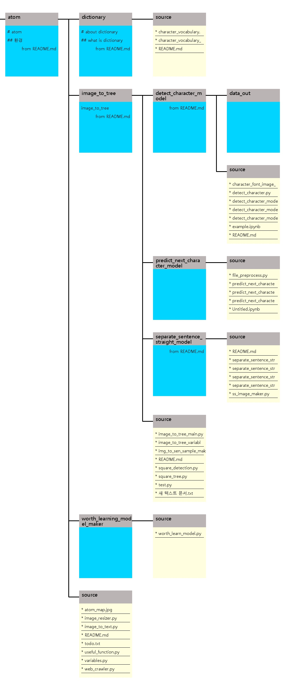

# atom

## atom 디렉토리 구조
{: width="50%" height="50%"}

* dictionary
* image_to_tree
    * learn_character_model
    * predict_next_character_model
    * separate_sentence_straight_model

##제작 규칙
### 일반 파일 제작 규칙
1. 파일의 이름은 만들고자 하는 기능을 적는 것이 바람직하다.
예시) image_to_tree : 이미지를 트리로, Dictionary : 단어 사전

2. 프로젝트의 가장 기본의 변수파일은 루트 밑의 variables이고 임포트시 VARIABLES로 한다.

### 모델 파일 제작 규칙
1. A_model 모델 폴더에 들어갈 필수 파일
    * A.py
        
        A라는 함수를 가지고 있고 나중에 불러와 실행시킬 함수를 가진 파일
        실행시 간단한 예제로 예측이나 분류를 실시
    * A_model_maker.py
    
        A의 앞글자를 딴 모델함수를 가지고 있는 파일
        ex) PNCM(), PNCM_loss_function()
        실행시 학습을 실시한다.
    * A_model_variables.py
        
        A_model_maker에서 사용될 변수들을 저장
    
    * A_model_preprocessing.py
    
        A_model의 전처리 과정을 총괄한다.
    
2. 위의 파일을 import 시 대문자 약자로 import 하고 variables 파일은 V, maker 파일은 M을 붙인다.
    예시) import predict_next_character_model_variables as PNCMV
    
### 데이터 저장 파일 규칙
1. atom_data라는 루트 아래에 각 파일별로 저장
 
    
## 환경
시스템 환경
cuda 10.2
python 3.6
tensor-gpu 2.0